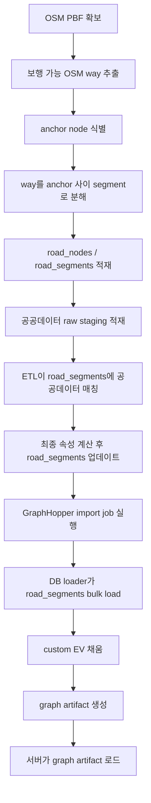
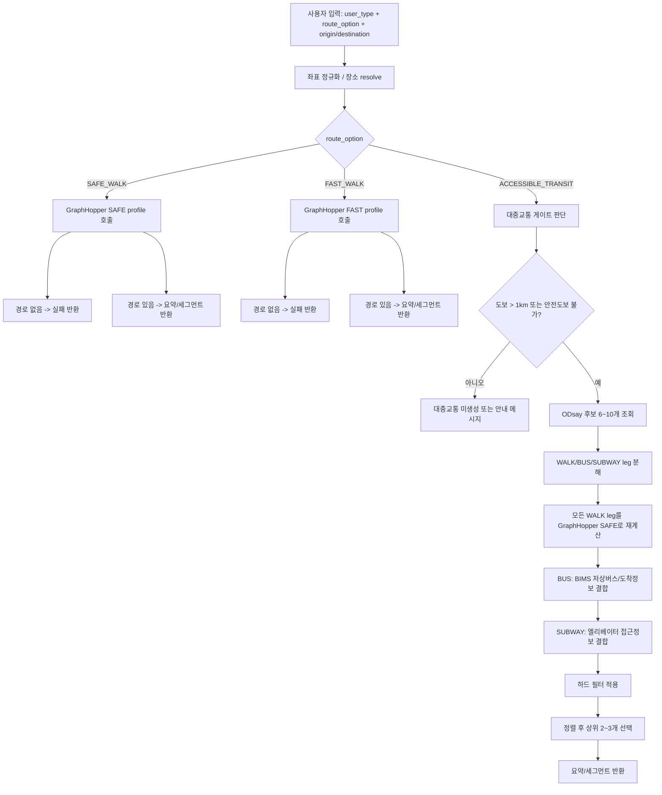

# 2026-04-16_ACCESSIBLE_ROUTING_POC_RESTART_BLUEPRINT

## 목적

이 문서는 새 저장소에서 접근성 라우팅 PoC를 다시 시작할 때 기준으로 사용할 공통 설계 문서다.

이번 문서의 목표는 아래 2가지를 한 번에 고정하는 것이다.

- OSM 기반 보행 네트워크 생성부터 GraphHopper import까지의 데이터 파이프라인
- `VISUAL`, `WHEELCHAIR` 사용자 유형과 `SAFE_WALK`, `FAST_WALK`, `ACCESSIBLE_TRANSIT` 옵션을 기준으로 한 최종 라우팅 정책 구조

이 문서는 구현 지시서라기보다 새 PoC를 다시 열 때 팀원이 같은 구조를 기준으로 시작할 수 있게 만드는 합의 문서다.

---

## 이번 문서에서 확정하는 것

### 1. 사용자 유형

- `VISUAL`
- `WHEELCHAIR`

### 2. 사용자 선택 옵션

- `SAFE_WALK`
- `FAST_WALK`
- `ACCESSIBLE_TRANSIT`

즉 최종 라우팅 정책은 `2 x 3 = 6개`다.

### 3. GraphHopper 프로필

GraphHopper에는 도보 프로필 4개만 둔다.

- `visual_safe`
- `visual_fast`
- `wheelchair_safe`
- `wheelchair_fast`

`ACCESSIBLE_TRANSIT`는 GraphHopper 프로필이 아니라 백엔드 오케스트레이션 모드로 처리한다.

### 4. OSM 세그먼트 생성 원칙

- `OSM way`를 그대로 DB edge로 적재하지 않는다.
- 보행 가능 `way`를 추출한 뒤 `anchor node` 기준으로 분해해 `road_segments`를 만든다.
- `road_nodes`는 모든 OSM node를 저장하지 않고, 실제 세그먼트 연결에 쓰인 anchor node만 저장한다.
- 중간 shape point는 `road_segments.geom` 안에 유지한다.

### 5. 안정 키 원칙

이번 PoC에서는 `source_dataset_version`을 DB 필수 키로 두지 않는다.

대신 `road_segments`의 안정 식별 기준은 아래 조합으로 둔다.

- `source_way_id`
- `source_osm_from_node_id`
- `source_osm_to_node_id`
- `segment_ordinal`

설명:

- `source_way_id`는 어떤 OSM way에서 나온 세그먼트인지 나타낸다.
- `source_osm_from_node_id`, `source_osm_to_node_id`는 그 세그먼트가 원천 OSM node 순서상 어디서 어디까지인지 나타낸다.
- `segment_ordinal`은 보조/검증용 순번이다.

운영 메타데이터 차원에서는 내려받은 PBF의 파일 경로, 수집일시, checksum을 별도로 관리할 수 있지만, 이번 PoC의 서비스 DB 안정 키에는 포함하지 않는다.

---

## 전체 구조



---

## 보행 네트워크 생성 플로우

### 1. OSM PBF를 내려받는다

- 입력:
  - 부산 범위 `.osm.pbf`
- 운영 메타데이터:
  - 원천 파일 경로
  - 수집일시
  - 파일 checksum
- 목적:
  - 새 PoC에서 사용할 원천 입력 파일을 고정한다.

### 2. OSM에서 보행 가능 `way`를 전부 추출한다

여기서는 아직 `edge`를 뽑는다고 쓰지 않는다.

- 필터 기준 예시:
  - `highway`
  - `foot`
  - `sidewalk`
  - `access`
  - `crossing`
  - `steps`
  - `elevator`
- 산출물:
  - `eligible_osm_way`
- 각 row 예시:
  - `way_id`
  - `ordered node refs`
  - `tags`
  - `geometry`

### 3. 각 보행 가능 `way`의 ordered node list에서 `anchor node`를 식별한다

최소 anchor 기준:

- `way`의 시작 node
- `way`의 끝 node
- 두 개 이상 보행 가능 `way`에 공통으로 등장하는 node

필요 시 추가 anchor 기준:

- `crossing`
- `steps`
- `elevator`
- 기타 속성 변화 지점

목적:

- 라우팅 가능한 최소 구간으로 나눌 분할 기준을 만든다.

### 4. `anchor node` 사이로 `way`를 분해해 `road_segments`를 생성한다

이 단계가 실제 `edge 생성` 단계다.

segment 1개는 최소 아래 정보를 가진다.

- `source_way_id`
- `source_osm_from_node_id`
- `source_osm_to_node_id`
- `segment_ordinal`
- 중간 shape point를 포함한 `LINESTRING`

주의:

- DB의 `road_segment`는 `way` 전체가 아니다.
- DB의 `road_segment`는 `anchor node` 사이의 구간이다.

### 5. `road_nodes`를 생성하고 `road_segments`와 함께 DB에 적재한다

`road_nodes`에는 보통 `segment`의 시작/끝으로 실제 사용된 anchor node만 적재한다.

모든 OSM node를 `road_nodes`에 다 넣을 필요는 없다.

중간 shape point는 `road_segments.geom` 안에 유지한다.

결과 구조 예시:

- `road_nodes(vertex_id, osm_node_id, point, ...)`
- `road_segments(edge_id, from_node_id, to_node_id, geom, length_meter, source_way_id, source_osm_from_node_id, source_osm_to_node_id, segment_ordinal, ...)`

### 6. 각 `road_segment`에 안정 키를 부여한다

권장 키:

- `source_way_id`
- `source_osm_from_node_id`
- `source_osm_to_node_id`
- `segment_ordinal`

권장 제약:

- `UNIQUE (source_way_id, source_osm_from_node_id, source_osm_to_node_id)`

해석:

- `source_way_id`는 원천 OSM way 식별자다.
- `source_osm_from_node_id`, `source_osm_to_node_id`는 세그먼트의 원천 OSM node 경계를 나타낸다.
- `segment_ordinal`은 보조/검증용이다.

---

## 공공데이터 매칭과 ETL 플로우

### 7. 공공데이터를 raw staging에 적재한다

예시:

- 교통약자 시설 원천
- 음향신호기
- 점자블록
- 엘리베이터
- 폭 정보
- 경사도 계산 입력

원칙:

- 이 단계는 원본 보존
- 아직 `road_segments`에 바로 덮어쓰지 않는다

### 8. ETL이 공공데이터를 `road_segments`에 매칭한다

매칭 방법 예시:

- 공간 매칭
- nearest
- overlap/intersection
- 수동 보정

산출물:

- `segment_attribute_match_result`

이 테이블에는 아래를 남긴다.

- 어떤 원천 레코드가
- 어떤 `road_segment`에
- 어떤 규칙으로
- 어떤 신뢰도로 붙었는지

### 9. ETL이 최종 속성을 계산해 `road_segments`에 반영한다

이번 PoC에서는 `segment_attribute_current`를 별도 테이블로 두지 않는다.

대신 ETL이 `road_segments`의 최종 속성 컬럼을 직접 계산해서 업데이트한다.

예시 컬럼:

- `walk_access`
- `width_meter`
- `has_audio_signal`
- `has_braille_block`
- `has_elevator`
- `surface_quality`
- `confidence`
- `source_updated_at`
- 정책용 상태 컬럼들

원칙:

- raw/staging 결과를 그대로 사용하지 않는다
- 최종 해석 결과만 `road_segments`에 반영한다
- GraphHopper import는 이 최종 반영된 `road_segments`를 읽는다

---

## GraphHopper import 플로우

### 10. GraphHopper import job을 실행한다

입력:

- `OSM PBF`
- GraphHopper config
- custom EV 정의
- `road_segments`

이 시점부터는 `road_segments.edge_id`가 아니라 안정 키 기준 lookup이 가능해야 한다.

### 11. import 과정에서 DB loader가 `road_segments`를 bulk load하고 custom EV를 채운다

권장 방식:

- import 시작 시 한 번에 모두 읽어 메모리 map 구성
- import 중 edge마다 DB query 하지 않음

lookup key:

- `source_way_id + source_osm_from_node_id + source_osm_to_node_id`

보조 검증:

- `segment_ordinal`

처리 방식:

- OSM parser가 `way`를 읽고 edge를 만들 때
- loader가 같은 segment를 찾아
- `walk_access`, `width_meter`, `has_audio_signal` 같은 값을 custom EV에 기록한다

### 12. import 결과로 `graph artifact`를 새로 생성한다

주의:

- custom EV 값은 graph 안에 baked-in 된다
- DB 값이 바뀌어도 기존 graph가 자동 반영되지는 않는다

따라서 속성 변경 시 필요한 작업:

- `road_segments` 재계산
- 재import
- 새 artifact 생성

### 13. 서버는 완성된 `graph artifact`를 로드해서 운영한다

원칙:

- 운영 서버는 가능하면 import를 하지 않고 load만 수행
- 운영은 `계산`보다 `로드` 중심이다

배포 단위 예시:

- PBF 파일 스냅샷
- `road_segments` 스냅샷
- `graph artifact` 버전

---

## 백엔드 입력 구조

백엔드 입력은 최소 아래 구조로 고정한다.

```json
{
  "user_type": "VISUAL | WHEELCHAIR",
  "route_option": "SAFE_WALK | FAST_WALK | ACCESSIBLE_TRANSIT",
  "origin": { "lat": 35.0, "lng": 129.0, "label": "반송시장" },
  "destination": { "lat": 35.0, "lng": 129.0, "label": "오시리아역" }
}
```

핵심 원칙:

- `user_type`을 명시적으로 받는다
- `route_option`을 명시적으로 받는다
- 더 이상 `1km 넘으면 자동으로 대중교통`으로 분기하지 않는다

정책:

- `SAFE_WALK`: 항상 도보 라우팅 시도
- `FAST_WALK`: 항상 도보 라우팅 시도
- `ACCESSIBLE_TRANSIT`: 게이트 충족 시에만 후보 생성

---

## ACCESSIBLE_TRANSIT 게이트

`ACCESSIBLE_TRANSIT`는 아래 조건일 때만 생성한다.

- GraphHopper 기준 최단 도보거리 `> 1.0km`
- 또는 GraphHopper 기준 안전 도보 프로필 경로 없음
- 또는 도보만으로는 정책상 너무 불리함

예시:

- 총 도보시간 20분 초과
- `wheelchair_safe` route not found

추천 규칙:

- `SAFE_WALK`: 항상 시도
- `FAST_WALK`: 항상 시도
- `ACCESSIBLE_TRANSIT`: 위 게이트 충족 시에만 시도

---

## EV 설계 원칙

새 PoC에서는 boolean EV보다 `YES/NO/UNKNOWN` 또는 상태 enum EV로 가는 것이 기준이다.

### 최소 EV 세트

- `braille_block_state = YES | NO | UNKNOWN`
- `audio_signal_state = YES | NO | UNKNOWN`
- `curb_ramp_state = YES | NO | UNKNOWN`
- `width_state = ADEQUATE_150 | ADEQUATE_120 | NARROW | UNKNOWN`
- `surface_state = PAVED | GRAVEL | UNPAVED | OTHER | UNKNOWN`
- `stairs_state = YES | NO | UNKNOWN`
- `elevator_state = YES | NO | UNKNOWN`
- `crossing_state = TRAFFIC_SIGNALS | UNCONTROLLED | UNMARKED | NO | UNKNOWN`
- `slope_state_visual_safe = PASS | FAIL | UNKNOWN`
- `slope_state_visual_fast = PASS | FAIL | UNKNOWN`
- `slope_state_wheelchair_safe = PASS | FAIL | UNKNOWN`
- `slope_state_wheelchair_fast = PASS | FAIL | UNKNOWN`

원칙:

- 숫자 비교를 라우팅 시점마다 하지 않는다
- ETL에서 정책용 상태값으로 변환해 둔다
- GraphHopper `custom_model`은 상태값 조건만 읽게 만든다

### 경사도 상태 정의

`VISUAL`

- `visual_safe`: `avg_slope_percent < 5`
- `visual_fast`: `avg_slope_percent < 8`

`WHEELCHAIR`

- `wheelchair_safe`: `avg_slope_percent < 3`
- `wheelchair_fast`: `avg_slope_percent < 5`

### 폭 상태 정의

- `ADEQUATE_150`: `width_meter >= 1.5`
- `ADEQUATE_120`: `1.2 <= width_meter < 1.5`
- `NARROW`: `0 < width_meter < 1.2`
- `UNKNOWN`: `null`

휠체어 정책:

- 허용: `ADEQUATE_150`, `ADEQUATE_120`
- 정렬 시 `ADEQUATE_150` 우선
- `NARROW`, `UNKNOWN` 제외

---

## 6개 정책 구조

### 1. `VISUAL + SAFE_WALK`

- `braille_block_state == YES`
- `crossing_state != NO`인 경우 `audio_signal_state == YES`
- `slope_state_visual_safe == PASS`
- `stairs_state != YES`
- `UNKNOWN` 포함 edge는 제외

### 2. `VISUAL + FAST_WALK`

- `braille_block_state == YES`
- `crossing_state != NO`인 경우 `audio_signal_state == YES`
- `slope_state_visual_fast == PASS`
- `UNKNOWN` 포함 edge는 제외
- `stairs_state`는 새 PoC에서 보수적으로 처리한다

기준:

- 처음부터 `YES면 제외` 또는 `YES 허용` 중 하나로 고정한다
- 현재 방향상 시각장애인 정책은 계단도 보수적으로 보는 편이 맞다

### 3. `VISUAL + ACCESSIBLE_TRANSIT`

- 도보 leg는 `VISUAL + SAFE_WALK` 기준 그대로 적용
- 버스/지하철 leg는 대중교통 정책 별도 적용

### 4. `WHEELCHAIR + SAFE_WALK`

- `stairs_state == NO`
- `crossing_state != NO`인 경우 `curb_ramp_state == YES`
- `surface_state not in {GRAVEL, UNPAVED}`
- `width_state in {ADEQUATE_150, ADEQUATE_120}`
- `slope_state_wheelchair_safe == PASS`
- `UNKNOWN` 포함 edge는 제외

### 5. `WHEELCHAIR + FAST_WALK`

- `stairs_state == NO`
- `crossing_state != NO`인 경우 `curb_ramp_state == YES`
- `surface_state not in {GRAVEL, UNPAVED}`
- `width_state in {ADEQUATE_150, ADEQUATE_120}`
- `slope_state_wheelchair_fast == PASS`
- `UNKNOWN` 포함 edge는 제외

### 6. `WHEELCHAIR + ACCESSIBLE_TRANSIT`

- 도보 leg는 `WHEELCHAIR + SAFE_WALK` 기준 그대로 적용
- 버스는 저상버스 접근 가능
- 지하철은 승차역/하차역/환승역 엘리베이터 접근 가능

---

## 대중교통 정책

### 1. 후보 생성 방식

`ACCESSIBLE_TRANSIT`는 ODsay 후보를 그대로 쓰지 않고 아래 순서로 재가공한다.

1. ODsay에서 상위 `6~10개` 후보 조회
2. 후보를 `WALK`, `BUS`, `SUBWAY` leg로 분해
3. 모든 `WALK` leg를 GraphHopper로 재계산
4. `user_type`별 `SAFE_WALK` 정책으로 `WALK` leg 검증
5. `BUS` leg 보강
6. `SUBWAY` leg 보강
7. 접근 불가 leg가 하나라도 있으면 후보 탈락
8. 남은 후보를 정렬
9. 상위 `2~3개` 반환

### 2. 대중교통 조합 허용 범위

허용:

- `BUS`
- `SUBWAY`
- `BUS + BUS`
- `BUS + SUBWAY`
- `SUBWAY + BUS`
- `SUBWAY + SUBWAY`

제한:

- transit leg 최대 `2개`
- 환승 최대 `1회`

### 3. 대중교통 후보 탈락 기준

`VISUAL`

- 모든 `WALK` leg가 `VISUAL + SAFE_WALK` 통과
- 버스 정류장 접근 `WALK` 통과
- 지하철 역 진입/환승/출구 `WALK` 통과
- 지하철 역 접근성 정보가 `UNKNOWN`이면 제외
- 버스 저상버스 여부가 `UNKNOWN`이면 제외

`WHEELCHAIR`

- 모든 `WALK` leg가 `WHEELCHAIR + SAFE_WALK` 통과
- 버스는 저상버스 가능 `== YES`
- 지하철은 엘리베이터 접근 `== YES`
- 관련 정보가 `UNKNOWN`이면 제외

### 4. 후보 정렬

`SAFE_WALK`

- 정책 위반 없는 경로
- 위험도 낮은 경로
- 총 거리 짧은 경로
- 총 시간 짧은 경로

`FAST_WALK`

- 정책 위반 없는 경로
- 총 시간 짧은 경로
- 총 거리 짧은 경로
- 위험도 낮은 경로

`ACCESSIBLE_TRANSIT`

- 접근 가능
- 총 시간 짧은 경로
- 총 도보거리 짧은 경로
- 환승 횟수 적은 경로
- 대기시간 짧은 경로
- 요금 낮은 경로

---

## 최종 응답 구조

응답은 처음부터 UI 친화적으로 반환한다.

```json
{
  "user_type": "WHEELCHAIR",
  "route_option": "ACCESSIBLE_TRANSIT",
  "result_type": "TRANSIT",
  "summary": {
    "total_distance_m": 6420,
    "total_duration_min": 31,
    "transfer_count": 1,
    "walk_distance_m": 520,
    "fare": 1600
  },
  "segments": [
    {
      "mode": "WALK",
      "policy_profile": "wheelchair_safe",
      "distance_m": 180,
      "duration_min": 3,
      "data_source": "GraphHopper"
    },
    {
      "mode": "BUS",
      "route_name": "1001",
      "low_floor_bus": "YES",
      "arrival_min": 5,
      "from_stop": "반송시장",
      "to_stop": "센텀시티"
    },
    {
      "mode": "SUBWAY",
      "line_name": "동해선",
      "elevator_access": "YES",
      "from_station": "벡스코",
      "to_station": "오시리아"
    }
  ]
}
```

---

## 요청 처리 흐름



---

## 새 PoC에서 바로 고정하는 결정

지금 기준으로 바로 문서화하고 구현 기준으로 삼아도 되는 결정은 아래다.

- boolean EV는 `YES/NO/UNKNOWN` enum EV로 전환
- `SAFE_WALK`, `FAST_WALK`, `ACCESSIBLE_TRANSIT` 3옵션 고정
- `VISUAL`, `WHEELCHAIR` 2유형 고정
- `ACCESSIBLE_TRANSIT`의 `WALK` leg는 항상 `SAFE` 기준 적용
- transit leg 최대 `2개`, 환승 최대 `1회`
- 반환 후보는 최대 `2~3개`
- `UNKNOWN`은 전부 제외
- 점자블록 공백 허용 로직은 이번 PoC에서 제외
- slope는 ETL 반영값 사용
- `road_segments`는 `OSM way`를 anchor 기준으로 분해한 구간으로 정의
- `road_segments`의 안정 키는 `source_way_id + source_osm_from_node_id + source_osm_to_node_id` 기준으로 둔다
- `road_nodes`는 모든 OSM node가 아니라 실제 segment 연결에 사용된 anchor node만 저장

---

## 구현 우선순위

### 1차

- OSM PBF 기준 `road_nodes`, `road_segments` 생성
- 안정 키 컬럼 반영
- enum EV 설계 확정
- GraphHopper 도보 프로필 4개 구성

### 2차

- 공공데이터 raw staging 적재
- ETL 매칭 및 정책용 상태 컬럼 계산
- GraphHopper import loader 확장

### 3차

- `ACCESSIBLE_TRANSIT` 게이트 및 오케스트레이션
- ODsay/BIMS/Subway 연계
- UI 친화 응답 구조 확정

---

## 결론

새 PoC의 핵심은 아래 두 줄로 요약된다.

- 보행 네트워크는 `OSM way`를 그대로 쓰지 않고 `anchor node` 기준으로 분해한 `road_segments`를 기준으로 만든다.
- 최종 라우팅은 `VISUAL/WHEELCHAIR x SAFE_WALK/FAST_WALK/ACCESSIBLE_TRANSIT`의 `6개 정책 구조`로 고정한다.

이 문서를 기준으로 새 저장소에서는 `보행 네트워크 생성`, `ETL 속성 계산`, `GraphHopper import`, `대중교통 오케스트레이션`을 같은 구조 아래에서 다시 시작한다.
